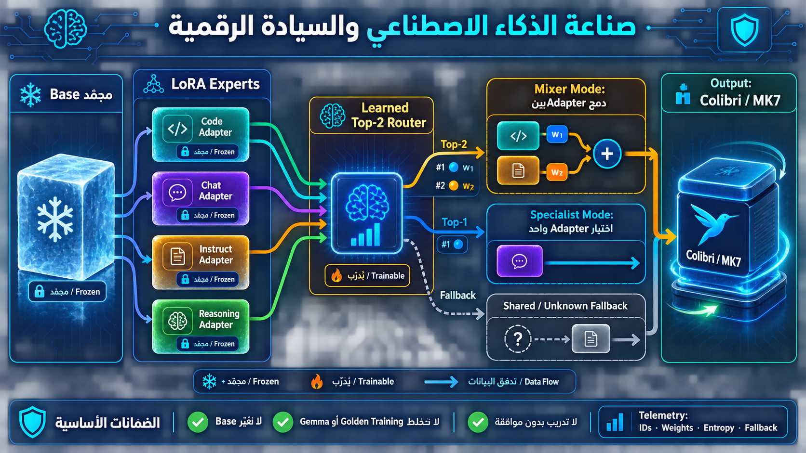
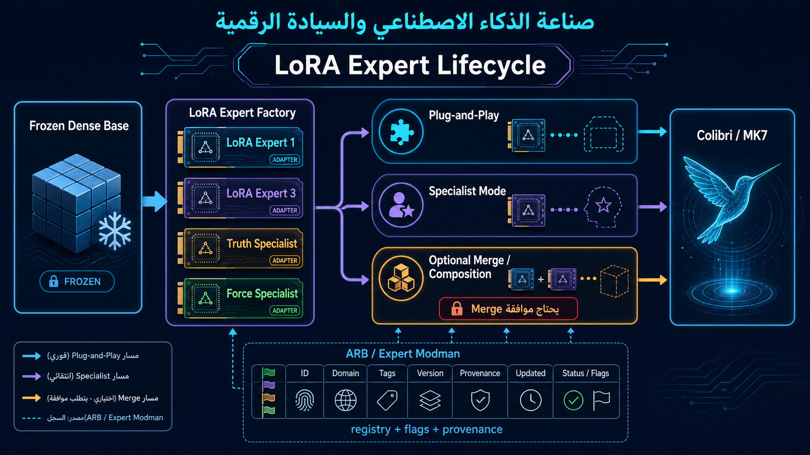
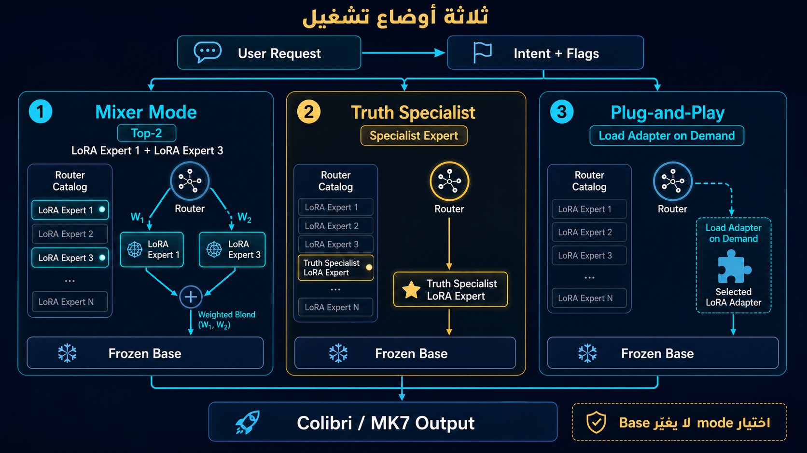
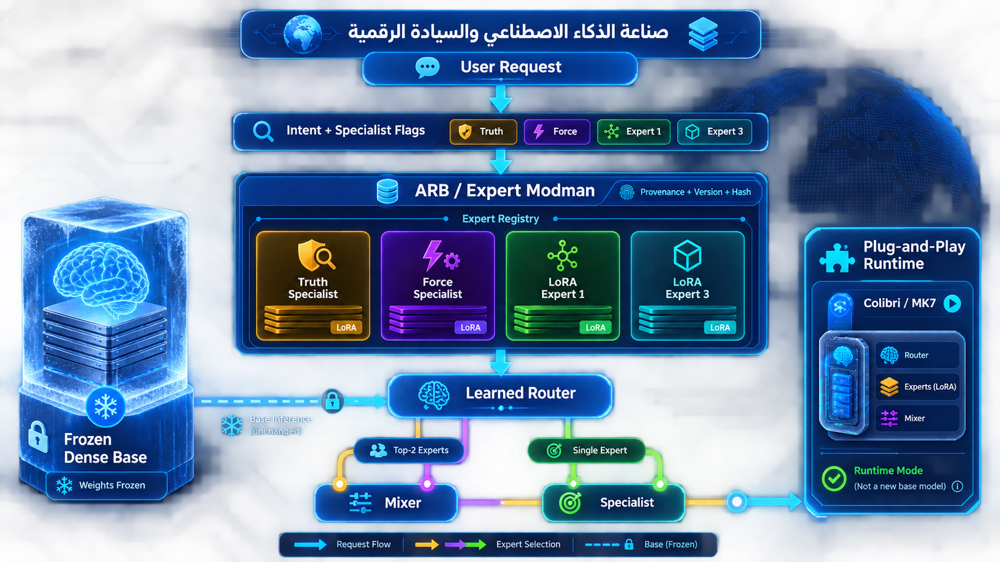

# صناعة الذكاء الاصطناعي والسيادة الرقمية

## Colibri / MK7 Router Lab

مختبر بحثي موثق لبناء Router قابل للقياس، وفهم Mixture-of-Experts، وتطوير أساس MK7 مع الحفاظ على استقلال البيانات والأوزان.

الصورة تلخص المسار: Base مجمّد، LoRA Adapters مستقلة، ثم اختيار اختياري بين Mixer Top-2 أو Specialist Top-1 أو Shared/Unknown Fallback.

## Infographic directions

### 1. LoRA Expert Lifecycle

كل LoRA يمكن أن يبقى Plug-and-Play، أو يعمل كـSpecialist، أو يدخل في Merge/Composition اختياري بعد موافقة.

### 2. Router Modes

نفس Base المجمّد يدعم Mixer Top-2 أو Truth Specialist أو تحميل Adapter عند الطلب.

### 3. ARB / Expert Modman

الـRegistry يحمل الـflags والـprovenance والنسخ والـhash قبل أن يصل الطلب إلى الـRouter.

## الحالة الحالية — 2026-08-17

- QMoE-400 FP32 smoke على CPU وQuadro P2000: `VERIFIED`.
- Router telemetry متعددة المجالات: `VERIFIED`.
- Frozen Experts / Router-only diagnostic بلا تحديث أوزان: `VERIFIED_NO_UPDATE`.
- MixLoRA local reference tests: `3/3 PASSED`.
- Dense + Frozen LoRA + learned Top-2 Router control: `VERIFIED`.
- Qwen2.5-0.5B Dense Base FP32 smoke on Quadro P2000: `VERIFIED`.
- Qwen + seven frozen LoRA adapters with Mixer/Specialist/Plug-and-Play: `VERIFIED`.
- Qwen Router v0.1.0 runtime Top-2 selection: `VERIFIED`.
- Qwen synthetic Router v0.3 closed-set: `100%`; unseen paraphrases: `42.86%` Top-1.
- Qwen synthetic Router v0.4 held-out validation: `71.43%` Top-1 / `100%` Top-2.
- GitHub staging محلي: commit history جاهزة للمراجعة.
- تدريب MK7: `NOT_STARTED`.
- رفع Hugging Face: `PENDING_OWNER_REVIEW`.

## الخطة الحالية

1. إبقاء v0.1.0 وv0.2.0 وv0.4.0 كنسخ immutable وإنشاء sibling versions فقط.
2. ربط حزمة Hugging Face موثقة عند حل صلاحية إنشاء Model repo.
3. إبقاء QMoE كـNative-MoE baseline وQwen كـDense+LoRA control.
4. تحسين التعميم الاصطناعي مع validation مستقل قبل أي استخدام حقيقي.
5. تنفيذ MK7 Router الحقيقي فقط بعد اختيار Base وموافقة التدريب المستقلة.
6. عدم لمس Golden Training أو Gemma أو MK7 Dataset.

## ما يحتويه المستودع

- `contracts/` — MK7 Router Contract وExpert Registry.
- `smoke/qmoe/` — QMoE smoke وtelemetry scripts.
- `results/qmoe/` — نتائج CPU/P2000 والـdiagnostics.
- `references/` — Tiny-MoE، Switch، MixLoRA، MoST، والمقارنة التاريخية.
- `manifests/` — revisions وlicenses وhashes وسياسة النشر.

## السجل التاريخي المختصر

### 2026-08-17 — QMoE وP2000

- تشغيل QMoE-400 بـFP32 على Quadro P2000.
- forward latency حوالي 0.97 ثانية لعينة smoke.
- استخراج Router telemetry و5 probes.

### 2026-08-17 — MK7 Router Design

- اعتماد Dense Base مجمد + Frozen LoRA Experts + learned Top-2 Router.
- إنشاء Router Contract وExpert Registry.
- التحقق من PyTorch control بلا Dataset أو optimizer step.

### 2026-08-17 — Synthetic Router Training

- تدريب Router فقط على 512 synthetic samples و120 خطوة.
- routing accuracy: `100%`.
- Base وLoRA Experts مجمّدة.
- لا Gemma ولا MK7 Dataset ولا Golden Training.

### 2026-08-17 — Qwen Dense Base and Router Versions

- تنزيل Qwen2.5-0.5B إلى F بصيغة Safetensors فقط، ثم FP32 forward smoke ناجح على P2000.
- إثبات توافق سبعة LoRA adapters مجمّدة مع `q_proj/v_proj`.
- v0.3 synthetic: closed-set `100%`، لكن unseen paraphrases `42.86%` Top-1.
- v0.4 synthetic: 35 paraphrases، validation `71.43%` Top-1 و`100%` Top-2.
- تثبيت v0.4 manifest والـhash وعدم استبدال النسخ السابقة.

### 2026-08-17 — Reference Research

- اختبار MixLoRA المحلي: Llama/Phi/Phi-3 forward tests نجحت `3/3`.
- توثيق Tiny-MoE وSwitch وMoST وOLMoE كمراجع منفصلة.
- تشغيل مقارنة MoST/Kimi/OLMoE Router mechanisms.

### 2026-08-16 — بداية المسار

- تثبيت F كمسار AI العامل.
- فصل Source Code وSafetensors وRuntime وArchive.
- إنشاء خطة MK7/MoE والالتزام بعدم التدريب في مسار المرجع.

## حدود صارمة

هذا المستودع لا يحتوي على model weights أو datasets أو Gemma أو Golden Training أو MK7 Dataset. لا يوجد Training Launcher. أي backward diagnostic موثق هنا لا يتضمن optimizer step أو weight update.

## حالات الدليل

`VERIFIED` دليل تشغيلي قابل للمراجعة؛ `PARTIAL` نتيجة جزئية؛ `UNRESOLVED` تحتاج تحققًا؛ `PENDING` لم تُنفذ بعد.
